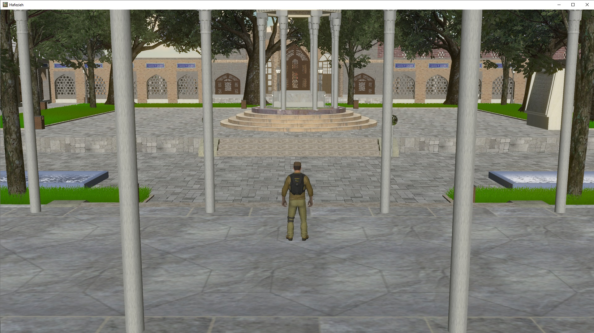

# Digital Reconstruction & Immersive 3D

## 3D Modeling · Digital Reconstruction · Computer Graphics · Interactive Environments · Virtual Reality

This repository presents selected projects from my earlier work in 3D modeling, digital reconstruction, computer graphics, interactive environments, real-time visualization, and immersive technologies.

The repository documents two major architectural reconstruction projects:

- **Hafezieh — Shiraz, Iran**
- **Dome of the Rock — Jerusalem**

These projects represent an earlier stage of my technical development in which I worked extensively with explicit 3D representations of real-world environments, architectural reconstruction, digital scene construction, visualization, and interactive environments.

The Hafezieh project was further developed into an interactive virtual environment, including a Virtual Reality version deployed for Meta Quest.

The Dome of the Rock project focused primarily on detailed architectural reconstruction and 3D modeling.

---

# Selected Work

## Hafezieh — Shiraz, Iran



### Interactive 3D Reconstruction · Virtual Environment · Virtual Reality · Meta Quest

Hafezieh is a detailed digital reconstruction of the Hafezieh complex in Shiraz, Iran.

The architectural environment was reconstructed as a detailed 3D scene and subsequently developed into an interactive environment using the Unity game engine.

The project evolved beyond static architectural visualization into an interactive virtual experience.

A dedicated Virtual Reality version was developed and deployed for **Meta Quest**, allowing users to explore the reconstructed environment immersively.

The project was also prepared for web-based interactive exploration.

### Development Pipeline

```text
Architectural Reference
        ↓
3D Geometric Reconstruction
        ↓
Detailed Architectural Modeling
        ↓
Materials & Scene Construction
        ↓
Unity Integration
        ↓
Interactive Environment
        ↓
Virtual Reality
        ↓
Meta Quest Deployment
        ↓
Web-Based Exploration
