# Hafezieh — Digital Reconstruction & Immersive 3D

A real-time 3D digital reconstruction of **Hafezieh (Tomb of Hafez)** in Shiraz, Iran, developed as an interactive environment for digital heritage, architectural visualization, immersive exploration, and XR experiences.

The project combines **3D architectural reconstruction, real-time rendering, interactive environments, digital humans, motion visualization, and immersive Virtual Reality** to create a digital representation of the historical Hafezieh complex.

The reconstructed environment was developed using professional 3D modeling workflows and integrated into the **Unity real-time engine**, with dedicated VR deployment for **Meta Quest** and preparation for web-based interactive exploration.

---

## ✦ Project Vision

The project explores how modern real-time 3D and immersive technologies can be applied to the preservation, visualization, and exploration of cultural heritage.

The long-term research direction extends the reconstructed environment toward:

* **Digital Heritage**
* **Real-Time 3D**
* **Extended Reality (XR)**
* **Virtual Reality (VR)**
* **Digital Humans**
* **Human Motion & Skeleton Tracking**
* **Computer Vision**
* **3D Scene Understanding**
* **Object Perception**
* **Depth & Spatial Perception**
* **AI-assisted Planning**
* **Interactive Virtual Environments**

---

## ✦ 3D Environment

The Hafezieh complex was reconstructed as a detailed, navigable 3D environment.

The digital scene represents the architectural and spatial characteristics of the historical site, including:

* Architectural structures
* Columns and decorative elements
* Courtyards and platforms
* Stairs and pathways
* Stone surfaces
* Gardens and vegetation
* Water features
* Environmental objects
* Outdoor lighting elements

The goal is to preserve the visual and spatial identity of the site while transforming it into an interactive real-time environment.

---

## ✦ Real-Time Interactive Environment

The reconstructed environment was integrated into **Unity** to transform the architectural model into an interactive real-time experience.

The Unity environment provides:

* First-person exploration
* Real-time 3D visualization
* Interactive navigation
* Environmental presentation
* Digital human interaction
* Motion visualization
* XR/VR support

This approach allows the reconstructed site to be experienced as a virtual environment rather than as a static architectural model.

---

## ✦ Digital Human & Motion

A digital human is integrated into the reconstructed environment to explore human interaction and movement within the architectural space.

The research visualization includes concepts such as:

```text
Digital Human
      │
      ├── Skeleton
      │
      ├── Human Motion
      │
      ├── Motion History
      │
      └── Motion Planning
```

The visual representation can be extended toward real-time skeleton visualization, pose analysis, motion history, and AI-assisted navigation.

---

## ✦ AI & Research Vision

The project is designed with a future-facing AI research layer that connects the reconstructed 3D world with perception and intelligent interaction.

### 3D World

```text
3D Environment
      │
      ├── Objects
      ├── Geometry
      ├── Depth
      └── Spatial Information
```

### AI Perception

```text
Camera
  ↓
Perception
  ↓
Object Detection
  ↓
Scene Understanding
  ↓
Semantic Representation
```

### Digital Human

```text
Human
  ↓
Skeleton
  ↓
Pose
  ↓
Motion
  ↓
Action
```

### AI Planning

```text
Scene Understanding
        ↓
      Planning
        ↓
    Path / Motion
        ↓
      Action
```

These components form the foundation for future integration of computer vision and AI-based interaction within the reconstructed cultural environment.

---

## ✦ Research Visualization

The project visualization presents an interface inspired by modern AI and robotics research systems.

The interface can represent:

* **3D World**
* **Digital Human**
* **Motion / Skeleton**
* **AI & Intelligence**
* **Object Perception**
* **Scene Understanding**
* **Depth Perception**
* **Motion Planning**

A conceptual pipeline is:

```text
                  RESEARCH VISION
                         │
       ┌─────────────────┼─────────────────┐
       │                 │                 │
   3D WORLD        DIGITAL HUMAN     AI PERCEPTION
       │                 │                 │
   Geometry          Skeleton        Detection
   Objects           Motion          Depth
   Environment       Pose            Segmentation
       │                 │                 │
       └─────────────────┼─────────────────┘
                         │
                    AI PLANNING
                         │
                    Path / Motion
```

---

## ✦ Virtual Reality

A dedicated VR version of the Hafezieh environment was developed for **Meta Quest**.

The VR experience enables users to explore the reconstructed historical environment from an immersive first-person perspective.

The project demonstrates how architectural reconstruction can be extended from traditional visualization into an immersive cultural heritage experience.

---

## ✦ Web-Based Exploration

The project was also prepared for **web-based interactive exploration**, providing an additional platform for presenting the reconstructed environment beyond desktop and VR applications.

This creates the possibility of making digital heritage experiences more accessible through browser-based 3D interaction.

---

## ✦ Development Pipeline

```text
Architectural References
          ↓
3D Geometric Reconstruction
          ↓
Detailed Architectural Modeling
          ↓
Materials & Texturing
          ↓
Scene Construction
          ↓
Lighting & Environment
          ↓
Unity Integration
          ↓
Interactive 3D Environment
          ↓
Virtual Reality
          ↓
Meta Quest Deployment
          ↓
Web-Based Exploration
```

---

## ✦ Technology Stack

### 3D & Digital Content

* **Autodesk Maya**
* **Adobe Photoshop**
* 3D Architectural Modeling
* Digital Environment Reconstruction
* Materials & Texturing

### Real-Time Development

* **Unity**
* Real-Time 3D
* Interactive Environment Development
* Real-Time Visualization

### XR / Immersive Technology

* **Virtual Reality**
* **Meta Quest**
* Immersive 3D Interaction
* XR-ready Environment

### AI / Research Direction

* Computer Vision
* 3D Perception
* Object Detection
* Depth Estimation
* Semantic Scene Understanding
* Human Pose & Skeleton
* Motion Analysis
* AI-assisted Planning

> AI and computer-vision components represent the research direction and visualization architecture of the project; individual AI models can be integrated as separate modules as the system evolves.

---

## ✦ System Architecture

```text
                         HAFEZIEH
                            │
                 ┌──────────┴──────────┐
                 │                     │
          3D Environment        Digital Human
                 │                     │
          ┌──────┼──────┐        ┌─────┼─────┐
          │      │      │        │     │     │
       Objects Geometry Depth   Pose Skeleton Motion
          │      │      │        │     │     │
          └──────┴──────┴────────┴─────┴─────┘
                            │
                     AI / Perception
                            │
              ┌─────────────┼─────────────┐
              │             │             │
          Detection      Scene         Planning
                         Understanding
              │             │             │
              └─────────────┼─────────────┘
                            │
                     Real-Time Unity
                            │
                  ┌─────────┴─────────┐
                  │                   │
                 VR                 Web
              Meta Quest        Interactive 3D
```

---

## ✦ Digital Heritage

Hafezieh is more than a conventional 3D environment.

It represents an approach to **digital cultural heritage**, where historical architecture can be reconstructed and experienced through modern interactive technologies.

The project investigates the intersection of:

**Cultural Heritage × 3D Reconstruction × Real-Time Rendering × XR × AI**

---

## ✦ Project Goals

* Digitally reconstruct a historical cultural site
* Create an interactive real-time 3D environment
* Enable immersive VR exploration
* Develop a foundation for digital heritage applications
* Visualize digital human movement inside architectural environments
* Explore AI-based scene perception
* Investigate spatial understanding and motion planning
* Provide a foundation for future AI/XR research

---

## ✦ VR Demonstration

A demonstration of the Hafezieh VR experience is available below:

[**▶ Watch Hafezieh VR Demonstration**](https://youtu.be/XV3qXUyJIvU)

---

## ✦ Future Development

The next stage of the project can extend the environment toward:

* Real-time object detection
* Semantic segmentation
* Depth-aware scene understanding
* Human pose estimation
* Real-time skeleton tracking
* AI-based navigation
* Intelligent path planning
* Digital human interaction
* Multimodal AI perception
* XR interaction
* Browser-based immersive experiences

---

## ✦ Keywords

`Hafezieh` `Shiraz` `Digital Heritage` `3D Reconstruction` `Unity` `Maya` `Real-Time 3D` `Virtual Reality` `Meta Quest` `XR` `Digital Human` `Computer Vision` `3D Perception` `Scene Understanding` `Object Detection` `Skeleton Tracking` `Motion Analysis` `AI Planning` `Spatial Computing`

---

# Hafezieh Gallery

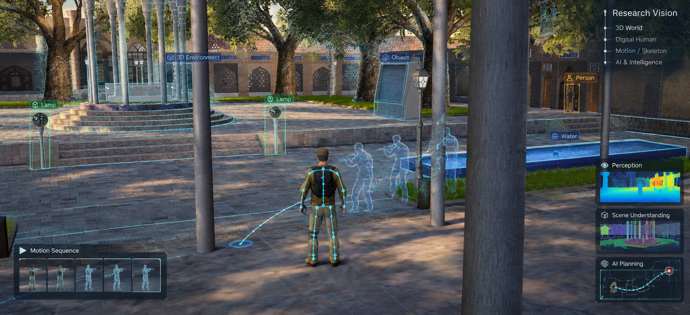


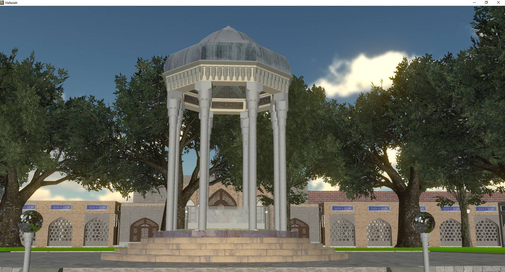

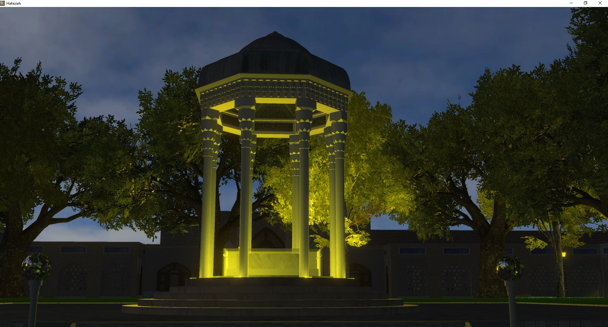

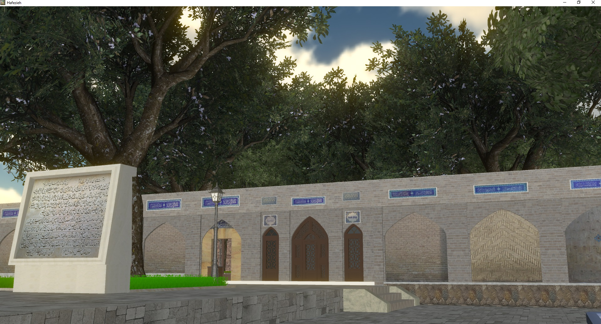

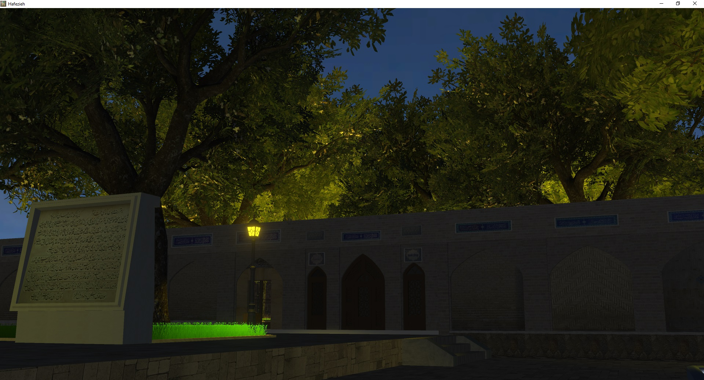

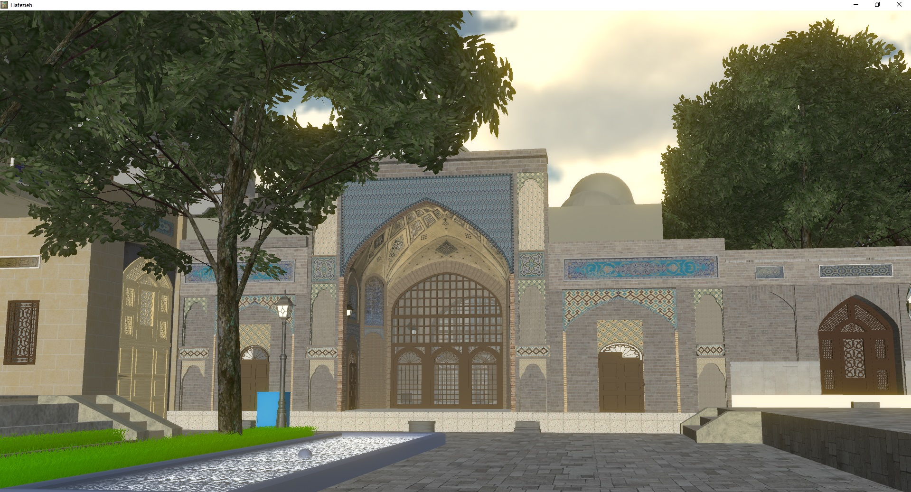

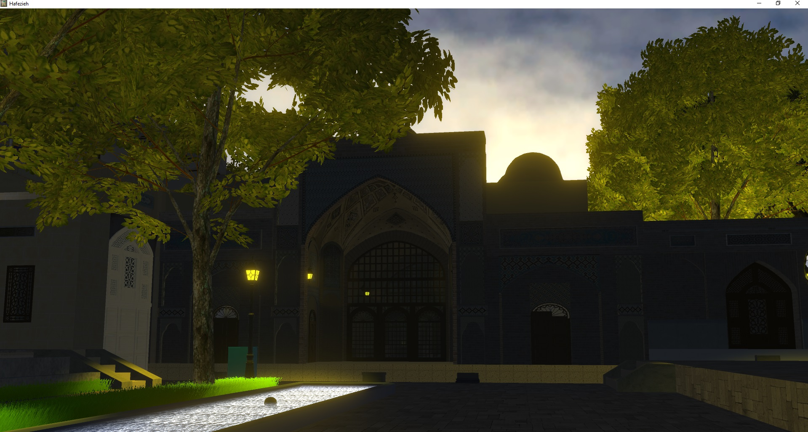

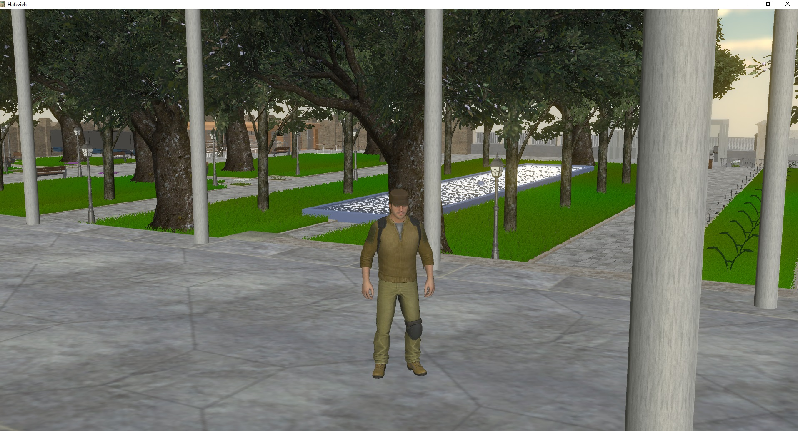

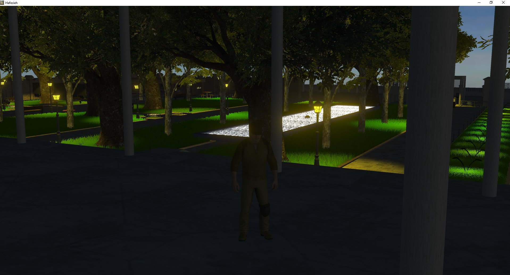

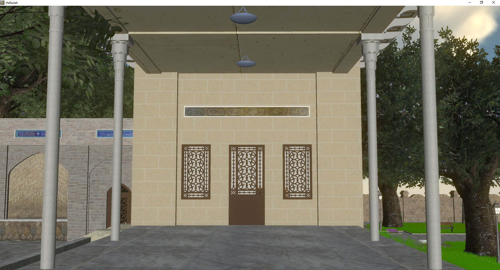

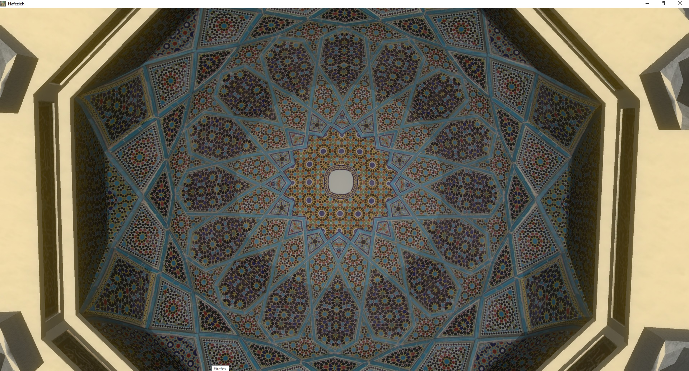

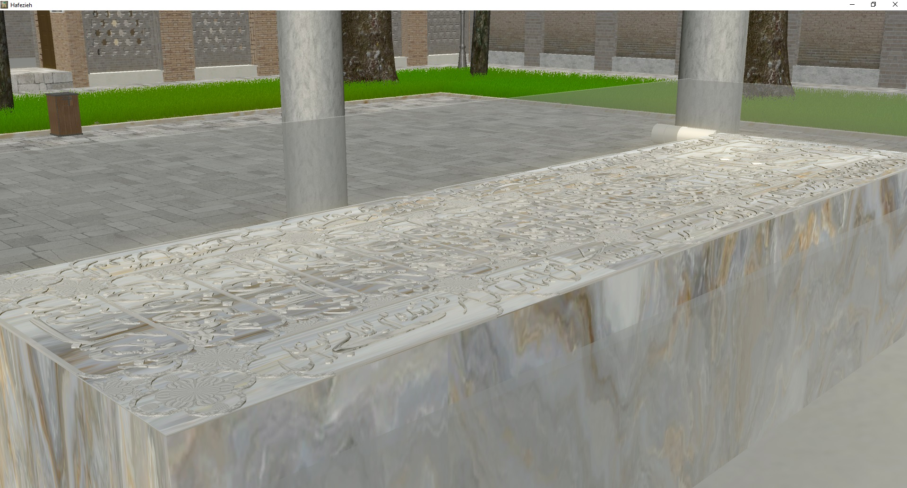

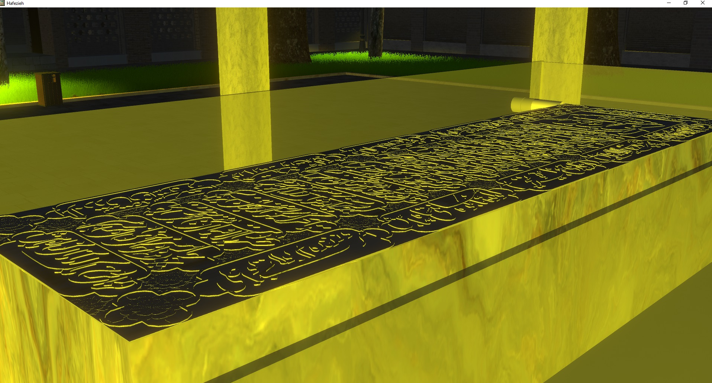

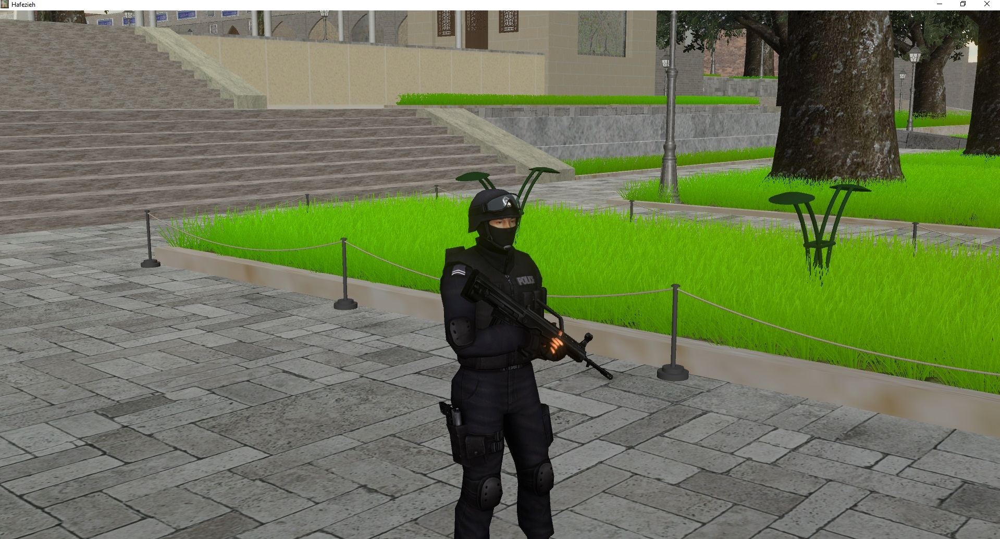

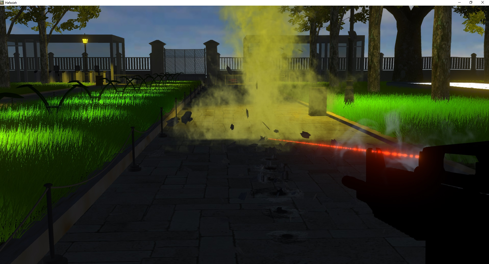

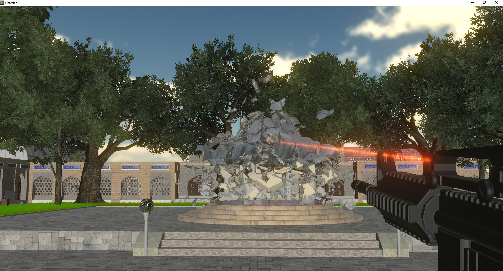

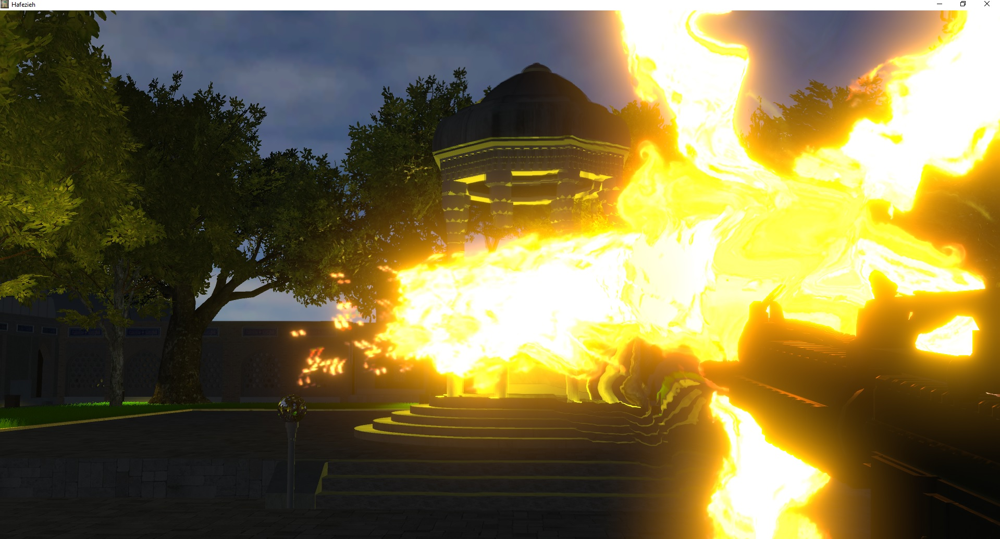

---

# Dome of the Rock

## Detailed Architectural 3D Reconstruction

The Dome of the Rock project involved detailed 3D modeling and digital reconstruction based on the real architectural structure in Jerusalem.

The project focused on reconstructing architectural geometry, structural elements, decorative components, and visual details of the building.

The work was developed using multiple professional 3D content-creation and visualization tools.

Unlike the Hafezieh project, the Dome of the Rock work presented here is primarily a detailed 3D reconstruction and architectural modeling project rather than a Virtual Reality deployment.

### Development Pipeline

Architectural Reference
↓
Geometric Interpretation
↓
Architectural Reconstruction
↓
Detailed 3D Modeling
↓
Scene Construction
↓
Materials & Textures
↓
Rendering / Visualization

### Technologies

- Autodesk Maya 2016
- Autodesk 3ds Max 2016
- Maxon Cinema 4D R16
- Adobe Photoshop

### Demonstration

https://youtu.be/ixAKYilsMNQ

---

# Dome of the Rock Gallery


---

# Technical Background

These projects provided extensive practical experience across several areas of computer graphics and digital reconstruction.

## 3D Modeling

The work included:

- Detailed polygonal modeling
- Architectural reconstruction
- Geometric decomposition
- Structural modeling
- Environmental modeling
- Scene construction
- Architectural detail modeling
- Digital representation of real-world structures

The objective was to reconstruct complex real-world architectural environments as coherent digital scenes.

---

# Digital Reconstruction

The general reconstruction workflow can be summarized as:

Real-World Architecture
↓
Visual / Architectural Reference
↓
Geometric Interpretation
↓
3D Modeling
↓
Detailed Digital Reconstruction
↓
Scene Assembly
↓
Materials / Visualization

This process required translating physical architectural structures into structured digital representations.

---

# Computer Graphics

The projects involved practical experience in:

- 3D geometry
- Architectural modeling
- Scene construction
- Materials
- Textures
- Lighting
- Rendering
- Visualization
- Real-time environments

The use of Maya, 3ds Max, Cinema 4D, Photoshop, and Unity provided experience across both digital content creation and interactive visualization workflows.

---

# Interactive 3D

The Hafezieh project extended beyond static architectural modeling into an interactive real-time environment.

The reconstructed environment was integrated into Unity and developed as an interactive digital space.

This included:

- Real-time scene visualization
- Interactive navigation
- First-person exploration
- Virtual environment development
- Virtual Reality
- Meta Quest deployment
- Web-based exploration

The transition can be summarized as:

3D Geometry
↓
Digital Scene
↓
Real-Time Environment
↓
Interactive Navigation
↓
Virtual Exploration
↓
Immersive Experience

---

# Virtual Reality

The Hafezieh project was extended into an immersive Virtual Reality experience.

The VR version was developed for Meta Quest, allowing users to explore the reconstructed architectural environment from an immersive first-person perspective.

This extended the project from architectural reconstruction into interactive and immersive computing.

### Hafezieh VR

https://youtu.be/zFWNZhsjqe4

---

# From Explicit 3D Representations to Intelligent Systems

These projects form an important part of the progression of my broader technical interests.

My earlier work focused on creating explicit digital representations of physical environments.

The progression of my work can be viewed as:

Physical Environment
↓
Explicit 3D Reconstruction
↓
Digital Environment
↓
Interactive Virtual Environment
↓
Computer Vision
↓
Learned Representations
↓
Embodied Intelligence

This progression has influenced my current interests in computer vision, representation learning, 3D understanding, human-centered AI, and embodied intelligence.

---

# Connection to Current Research

My current research increasingly focuses on learned representations rather than manually constructed representations.

Current interests include:

- Computer Vision
- Representation Learning
- 3D Understanding
- Human-Centric Representations
- Human Motion Understanding
- Visual Representation Analysis
- Embodied Intelligence
- Humanoid Robotics

A central connection between my earlier graphics work and current AI research is the study of representation.

Earlier work:

Physical World
↓
Human-Designed 3D Representation

Current research:

Physical / Visual Information
↓
Learned Representation
↓
Intelligent System

This creates a continuous technical trajectory from computer graphics and digital reconstruction toward computer vision, representation learning, and embodied AI.

---

# Selected Technical Experience

| Area | Experience |
|---|---|
| 3D Modeling | Detailed architectural and environmental reconstruction |
| Digital Reconstruction | Reconstruction of real architectural environments |
| Computer Graphics | Geometry, materials, scene construction and visualization |
| Architectural Visualization | Detailed digital environments |
| Real-Time 3D | Interactive Unity environments |
| Virtual Reality | Hafezieh immersive environment |
| VR Hardware | Meta Quest |
| Interactive Systems | Navigation and virtual exploration |
| Web Visualization | Interactive Hafezieh deployment |
| Computer Vision | Current research in visual representation |
| Representation Learning | Current research in latent representations |
| Robotics | Current research in humanoid intelligence |

---

# Software & Technologies

## 3D / Graphics

- Autodesk Maya
- Autodesk 3ds Max
- Maxon Cinema 4D
- Adobe Photoshop

## Real-Time / Interactive

- Unity
- Real-time rendering
- Interactive 3D environments
- Virtual Reality

## VR

- Meta Quest

## Current Research

- Python
- Deep Learning
- Computer Vision
- Representation Learning
- 3D Understanding
- Human Motion Analysis
- Embodied AI

---

# Project Comparison

| Project | Main Focus | Interactive | VR | Platform |
|---|---|---:|---:|---|
| Hafezieh | 3D reconstruction & interactive environment | Yes | Yes | Unity / Meta Quest / Web |
| Dome of the Rock | Detailed architectural reconstruction | No | No | 3D visualization |

---

# Selected Project Demonstrations

## Hafezieh — Virtual Reality

https://youtu.be/XV3qXUyJIvU

## Dome of the Rock — 3D Reconstruction

https://youtu.be/ixAKYilsMNQ

---

# Research & Collaboration

My background combines extensive practical experience in:

- 3D modeling
- Digital reconstruction
- Computer graphics
- Interactive environments
- Virtual Reality

with my current research interests in:

- Computer Vision
- Representation Learning
- 3D Understanding
- Human Motion
- Embodied Intelligence
- Humanoid Robotics

I am particularly interested in research at the intersection of:

Computer Graphics
+
Computer Vision
+
3D Understanding
+
Representation Learning
+
Robotics
+
Embodied AI

I would be interested in contributing to research where this combination of 3D modeling, computer vision, AI, and interactive systems could be useful.

If a research group or laboratory is working on problems where these areas intersect, I would be very interested in discussing potential research contributions or collaboration.

---

# Repository Purpose

This repository documents selected earlier projects that formed an important part of my technical background.

The purpose is not only to present individual 3D projects, but also to document a progression from:

Explicit 3D Reconstruction
↓
Computer Graphics
↓
Interactive Environments
↓
Virtual Reality
↓
Computer Vision
↓
Learned Representations
↓
Embodied Intelligence

These projects demonstrate practical experience with constructing digital representations of real-world environments and transforming those representations into interactive and immersive systems.

---

# Project Structure

Digital-Reconstruction-Immersive-3D/

├── README.md
│
├── media/
│   │
│   ├── dome-of-the-rock/
│   │   ├── Dome of the Rock-01.jpg
│   │   ├── Dome of the Rock-02.jpg
│   │   ├── Dome of the Rock-03.jpg
│   │   ├── Dome of the Rock-04.jpg
│   │   ├── Dome of the Rock-05.jpg
│   │   └── README.md
│   │
│   └── hafezieh/
│       ├── Hafezieh-06.jpg
│       ├── Hafezieh-07.jpg
│       ├── Hafezieh-08.jpg
│       ├── Hafezieh-09.jpg
│       ├── Hafezieh-10.jpg
│       ├── Hafezieh-11.jpg
│       ├── Hafezieh-12.jpg
│       ├── Hafezieh-13.jpg
│       ├── Hafezieh-14.jpg
│       ├── Hafezieh-15.jpg
│       ├── Hafezieh-16.jpg
│       ├── Hafezieh-17.jpg
│       ├── Hafezieh-18.jpg
│       ├── Hafezieh-19.jpg
│       ├── Hafezieh-20.jpg
│       ├── Hafezieh-21.jpg
│       ├── Hafezieh-22.jpg
│       └── README.md
│
└── projects/
    │
    ├── dome-of-the-rock/
    │   └── README.md
    │
    └── hafezieh/
        └── README.md

---

# Documentation

Detailed project documentation is available in:

projects/hafezieh/README.md

projects/dome-of-the-rock/README.md

These documents provide additional information about the respective reconstruction workflows, technical approaches, and project scope.

---

# Note on Project Scope

These projects represent earlier technical work in:

- 3D modeling
- Digital reconstruction
- Computer graphics
- Interactive environments
- Real-time visualization
- Virtual Reality

They are presented as part of my broader technical background and as evidence of hands-on experience constructing and visualizing complex digital environments.

My current research has increasingly moved toward AI-based representations, computer vision, human motion understanding, and embodied intelligence.

The combination of these backgrounds motivates my interest in research connecting:

3D World Representation
+
Visual Understanding
+
Learned Representations
+
Physical Interaction
+
Embodied Intelligence

---

# Contact

Majid Khorramgah

AI Researcher · Computer Vision · Representation Learning · 3D Understanding · Embodied Intelligence

LinkedIn:

https://www.linkedin.com/in/majidkhorramgah
